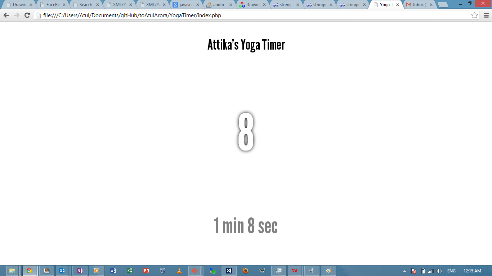

YogaTimer
=========

This is a simple JQuery based timer that beeps every 30 and 60 seconds with distinguishable alerts. Following is a screenshot. You can change the alert sounds by replacing the files in the media folder. Stay healthy :)

Installation
--

* Clone the repository using the buttons on the right. 
* Then extract it if required (in windows, double click and follow the instructions).
* Open the index.php file inside the YogaTimer folder with chrome ALTERNATIVELY, drag it into chrome (you can use whichever browser you like)